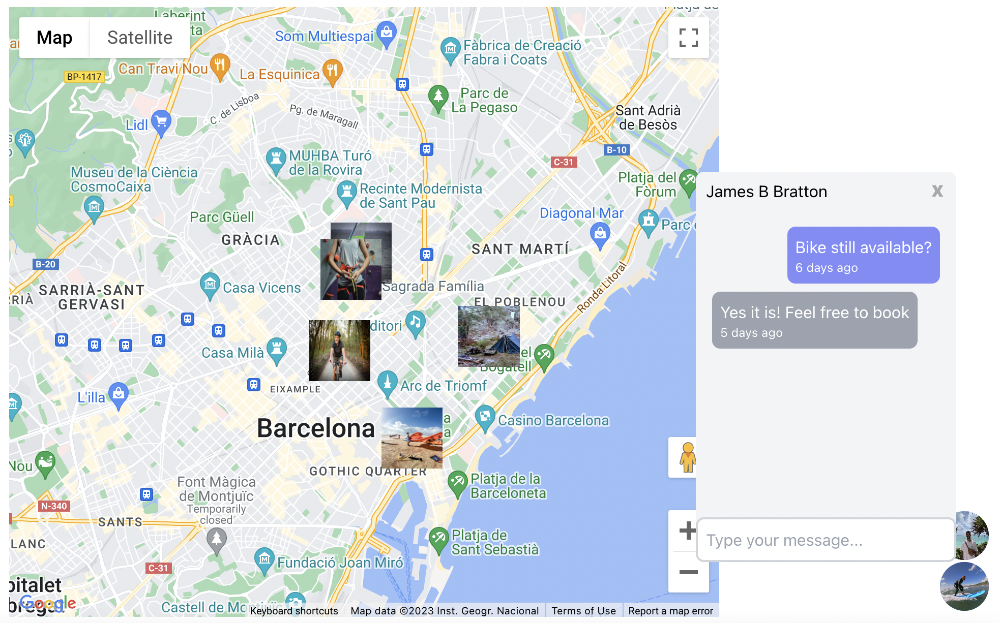

# GearHub

A peer-to-peer sports gear rental platform. Imagine Airbnb for renting sports gear (bikes, surfboards, etc.)

The app grants users the ability to create profiles and either rent equipment to or from others. They are able to find either lessors or lessees based on proximity, availability and price. It is essentially a marketplace for short-term rentals, complete with authentication, chat card payments, and a rating and review system.

## Tech stack

**Front-end:** React, Supabase, Tailwind;  
**Back-end:** Express, Stripe API.

## Team

Four full-stack engineers:

[@gabrielschull](https://www.github.com/abrielschull) Gabriel Schull  
[@raaulhb](https://www.github.com/raaulhb) Raul Barros  
[@ivaaan](https://www.github.com/ivaaan) Ivan Afanasev  
[@jbratton12](https://www.github.com/jbratton12) James Bratton

